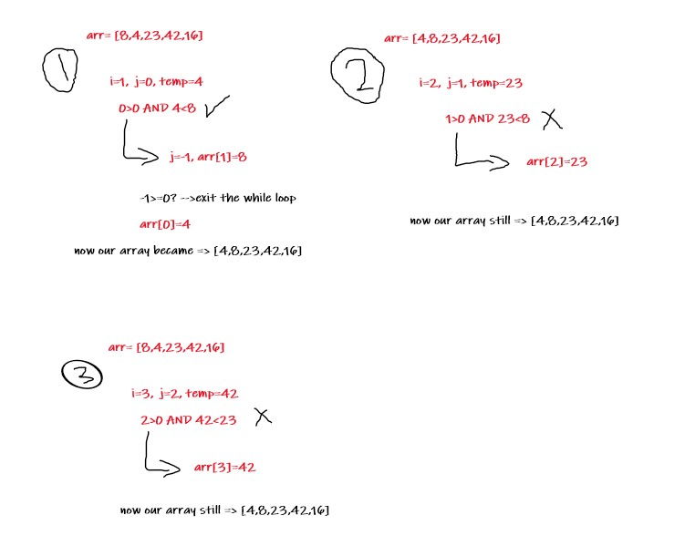
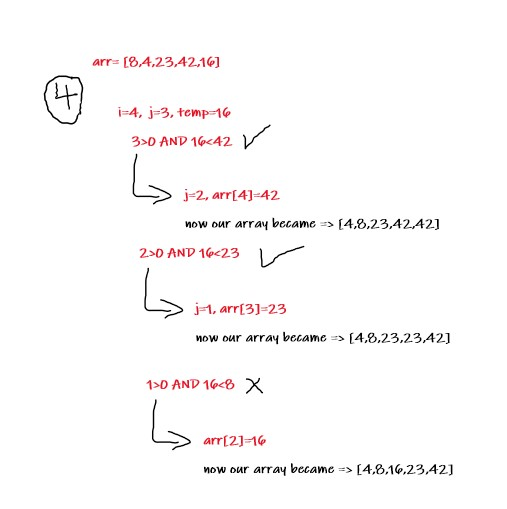

# Challenge Summary
Write the Implementation for the Insertion Sort algorithm and test your implementation so you will be able to give your method an unordered array and return an ordered array
### White Board
### Code
### Trace
<!-- 
 -->
## Approach & Efficiency
- Space O(n)
- Time O(n^2)
