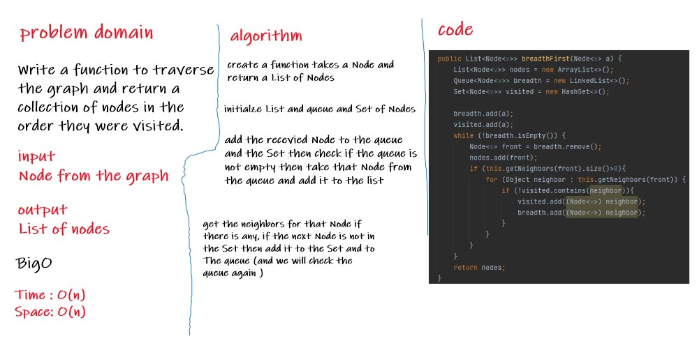

# Challenge Summary
Write a function to traverse the graph and return a  collection of nodes in the order they were visited.
## Whiteboard Process

## Approach & Efficiency
- Space O(n), because we will create a list and queue and Set.
- Time O(n),because we will loop through the queue and repeat this operation as long as i have neighbors for the Node
