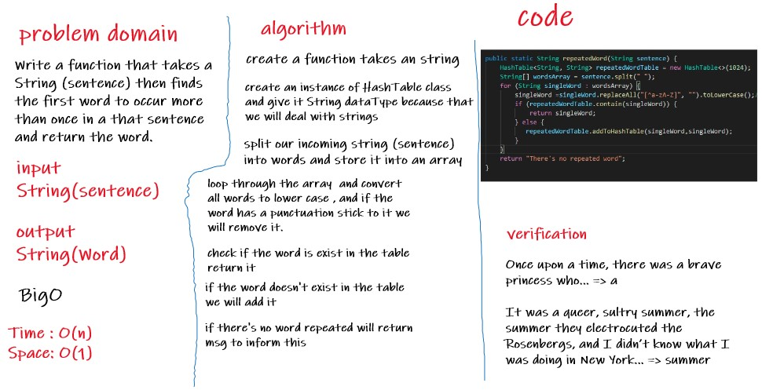

# Challenge Summary
Write a function that takes a String (have sentence) then finds the first word to occur more than once in a that sentence and return the word.
## Whiteboard Process

## Approach & Efficiency
- Space O(n), because we will create an Array
- Time O(1),because we insert and get tha values directly from the index

