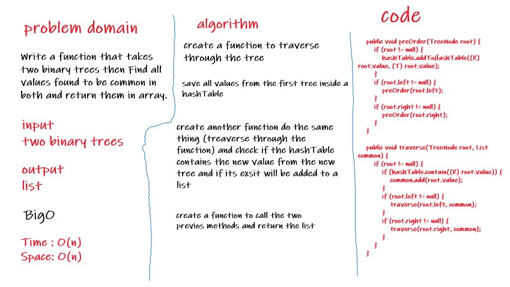

# Challenge Summary
Write a function that takes two binary trees then Find all values found to be common in both and return them in array.
## Whiteboard Process

## Approach & Efficiency
- Space O(n), because we will create a List
- Time O(n),because we have a recursive call