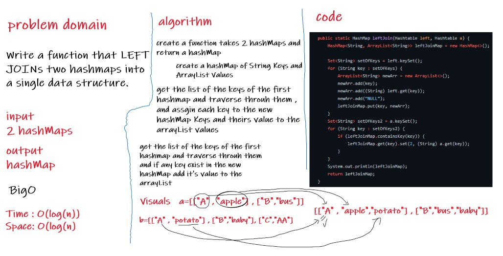

# Challenge Summary
Write a function that LEFT JOINs two hashmaps into a single data structure.
## Whiteboard Process

## Approach & Efficiency
- Space O(n), because we will create a hashmap ans lists
- Time O(n),because we have a loops