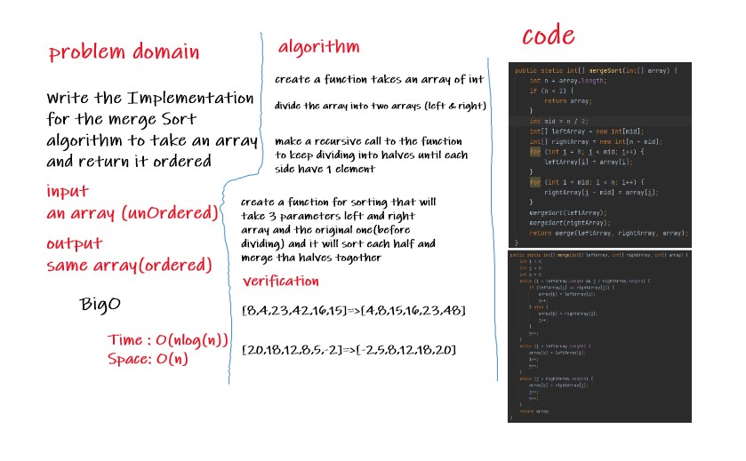
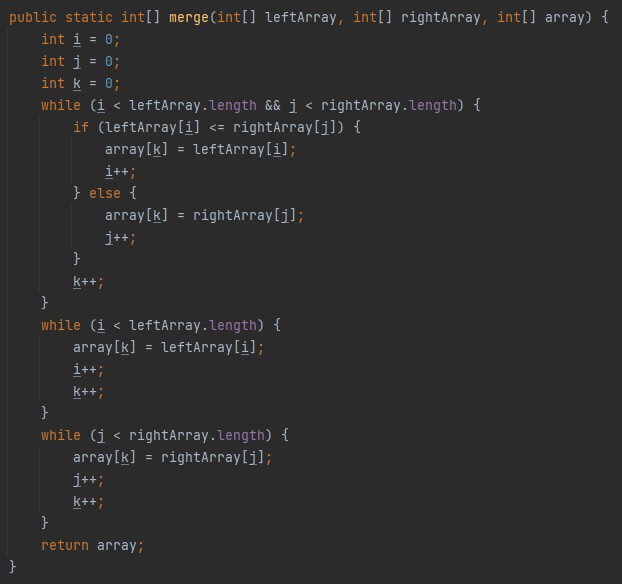
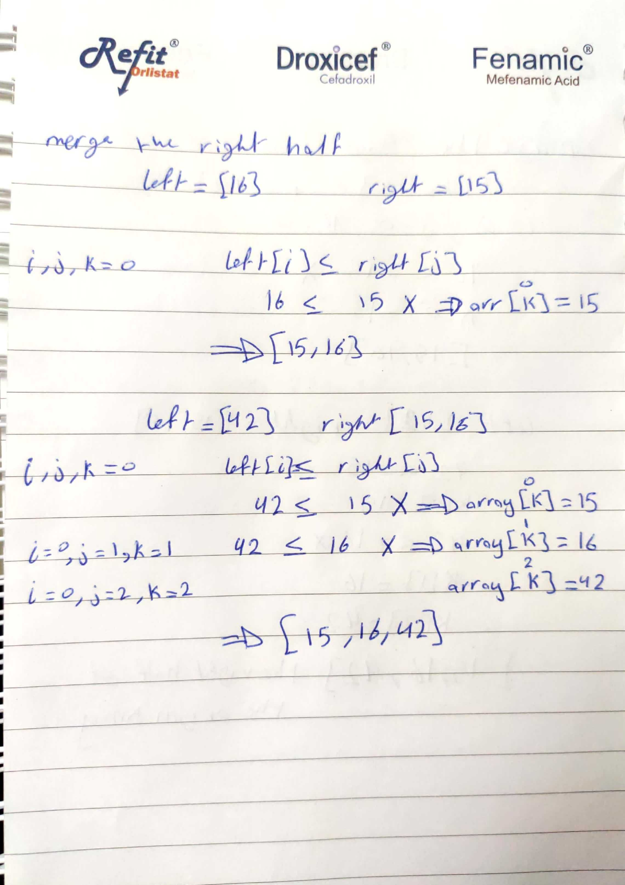

## Challenge Summary
Write the Implementation for the Insertion Sort algorithm and test your implementation so you will be able to give your method an unordered array and return an ordered array
## White Board

## Code
- mergeSort method (to divide the array and call the merge method to sort the arrays)

- merge method (to sort the arrays)

## Trace
- pass the array to the mergeSort function to divide it into halves, it will keep divide it by recursive call until each half contain only one element

- sort the left half of array, we will do that by comparing each side half with the other and take the smaller one and inser into the original one before dividing

- we will repeat the sorting operation on the left half 

- now we have two sorted halves we will merge the two arrays to became one sorted array

## Approach & Efficiency
- Space O(n)
- Time O(n^2)
