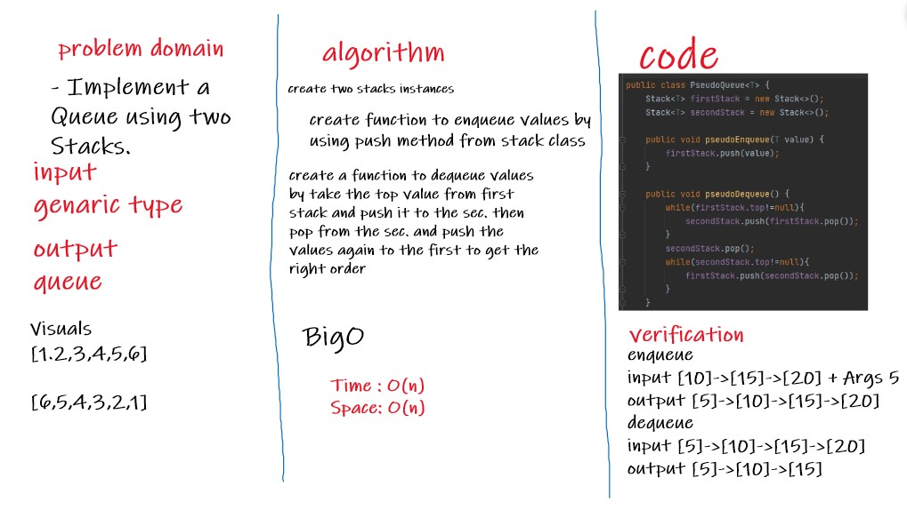

# Stacks and Queues
- A stack is a data structure that consists of Nodes. Each Node references the next Node in the stack.
- The queue is a linear data structure used to represent a linear list. It allows insertion of an element to be done at one end and deletion of an element to be performed at the other end.
## Challenge
Write a code of Implementation of Stacks and Queues.
## Approach & Efficiency
Time = BigO(1)
Space = BigO(n)

---

# Pseudo Queue
- Implement a Queue using two Stacks.
## Whiteboard Process

## Challenge
- Write a code of Implementation Queues methods with using two stack instances with using stacks methods.

