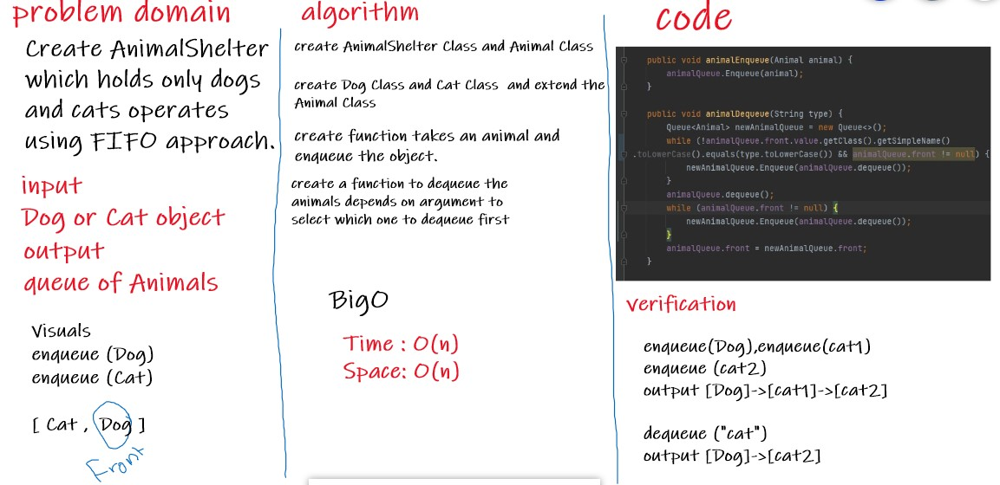

# Challenge Summary
Create a AnimalShelter which holds only dogs and cats operates using a first-in, first-out approach.

## Whiteboard Process

## Approach & Efficiency
Time = BigO(n)
Space = BigO(n)

