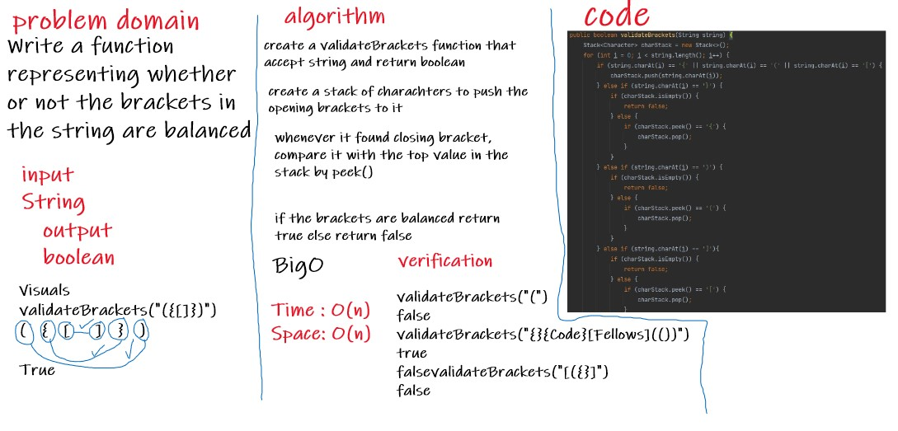

# Challenge Summary
Write a function called validate brackets takes string and Return boolean representing whether or not the brackets in the string are balanced

## Whiteboard Process

## Approach & Efficiency
Time : O(n)
Space: O(n)
