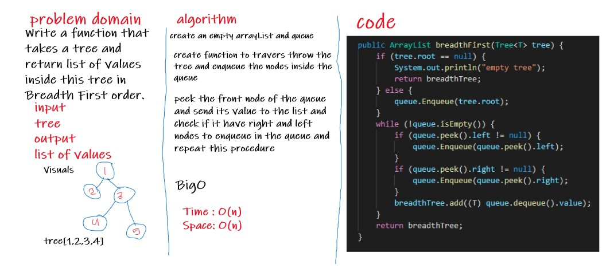

# Challenge Summary
Write a function that takes a tree and return list of values inside this tree in Breadth First order.

## Whiteboard Process

## Approach & Efficiency
- Time : O(n)
- Space: O(n)

